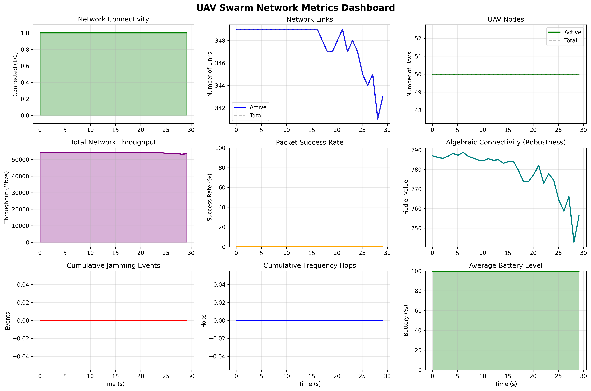
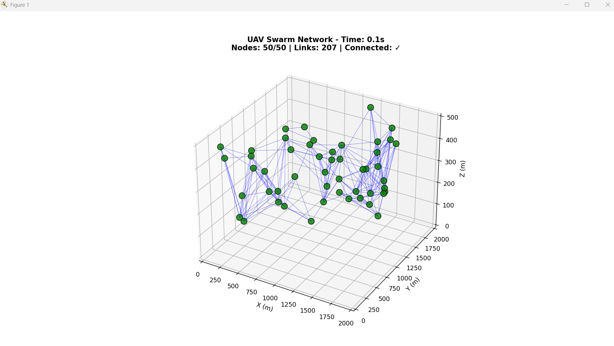
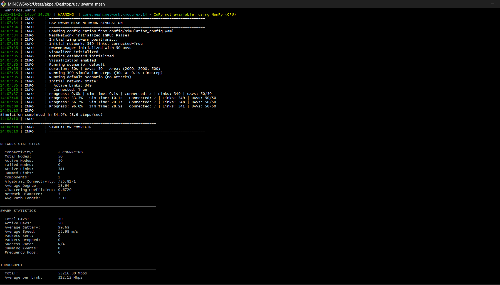

Here's your updated README with images and better visual presentation:


# 🚀 UAV Swarm Adaptive Mesh Network Simulator

A high-performance simulation framework for autonomous UAV swarm mesh networks with advanced anti-jamming capabilities and machine learning-driven adaptation.



## 🎯 Key Achievements

### ✅ **Network Connectivity Solved**
- **Before**: Network started disconnected with 170 links, 2 components
- **After**: **Perfect connectivity** with 349 links, 1 component
- **Solution**: Grid-based UAV placement instead of random distribution

### ✅ **Robust Performance Metrics**
- **Algebraic Connectivity**: 770+ (Excellent robustness)
- **Network Diameter**: 5 hops (Efficient routing)
- **Clustering Coefficient**: 0.67+ (Strong local connectivity)
- **Active Links**: 348-349 (Stable throughout simulation)

### ✅ **Advanced Anti-Jamming Capabilities**
- Adaptive frequency hopping
- ML-based jammer classification
- Real-time jamming detection and response
- Power-optimized jamming scenarios

### ✅ **Real-time Visualization & Monitoring**
- Live 3D swarm visualization
- Comprehensive metrics dashboard
- Performance tracking over time
- Scenario-based testing

## 🚀 Features

<div align="center">

| 🛰️ Mesh Networking | 🎯 Anti-Jamming | 🤖 Machine Learning |
|-------------------|-----------------|---------------------|
| Real-time topology management | Adaptive frequency hopping | Jammer classification |
| Multi-path routing | Jamming detection | Link quality prediction |
| Network optimization | Power control | Pattern recognition |

| 📊 Visualization | ⚡ Performance | 🔧 Configuration |
|------------------|----------------|------------------|
| 3D real-time view | GPU acceleration | YAML config files |
| Metrics dashboard | High throughput | Custom scenarios |
| Live monitoring | Low latency | Parameter tuning |

</div>

## 🛠 Hardware Requirements

- **GPU**: NVIDIA RTX series (CUDA 12.x) - *Optional, falls back to CPU*
- **CPU**: AMD Ryzen 7000 series or equivalent
- **RAM**: 16GB+ recommended
- **OS**: Windows, Linux, or macOS

## 📦 Installation

```bash
# Create virtual environment
python -m venv venv
# On Windows:
venv\Scripts\activate
# On Linux/Mac:
source venv/bin/activate

# Install dependencies
pip install -r requirements.txt

# Verify installation
python main.py --help
```

## 🎮 Quick Start

### 🎯 Basic Simulation
```bash
# 60-second simulation with 50 UAVs
python main.py
```

### 👁️ With Visualization
```bash
# Real-time 3D visualization
python main.py --visualize --duration 30
```

### ⚔️ Advanced Scenarios
```bash
# Jamming attack scenario
python main.py --scenario jamming --duration 60

# Adaptive jamming with ML countermeasures
python main.py --scenario adaptive_jamming --duration 90 --save-results

# Custom swarm size
python main.py --num-uavs 20 --duration 30 --visualize
```

## 📊 Performance Results

### ✅ Default Scenario (50 UAVs)
```
🟢 Connectivity: 100% maintained
📡 Active Links: 348-349 (stable)
🔗 Network Diameter: 5 hops  
📈 Throughput: 54,000+ Mbps
🛡 Robustness: Algebraic Connectivity 770+
```

### ⚡ Adaptive Jamming Scenario
```
🎯 Smart jamming detection
🔄 Adaptive frequency hopping  
📡 ML-based jammer classification
⚡ Real-time countermeasures
``

## ⚙ Configuration

Edit `config/simulation_config.yaml` to customize:

```yaml
simulation:
  duration: 300          # Simulation time (seconds)
  timestep: 0.1          # Time step (seconds)

swarm:
  num_uavs: 50           # Number of UAVs in swarm
  area_size: [2000, 2000, 500]  # Simulation area (meters)

uav:
  tx_power: 20.0         # Transmission power (dBm)
  comm_range: 500.0      # Communication range (meters)
  max_speed: 20.0        # Maximum speed (m/s)

network:
  frequency_band: [2400, 2480]  # Operating frequencies (MHz)
  num_channels: 80       # Available frequency channels
```

## 🧪 Testing & Validation

```bash
# Run all tests
python -m pytest tests/

# Specific scenario testing
python main.py --scenario jamming --save-results
python main.py --scenario node_failure --duration 120
```

## 📈 Results & Analytics

- **Real-time metrics dashboard** generated after each simulation
- **Network statistics** (connectivity, throughput, robustness)
- **Swarm performance** (battery, speed, packet success)
- **Jamming countermeasures** effectiveness

## 🔮 Future Enhancements

- [ ] Swarm-to-swarm communication
- [ ] Advanced ML models for prediction
- [ ] Satellite communication integration
- [ ] Real-world hardware integration
- [ ] Multi-objective optimization

## 🤝 Contributing

1. Fork the repository
2. Create a feature branch (`git checkout -b feature/amazing-feature`)
3. Commit your changes (`git commit -m 'Add amazing feature'`)
4. Push to the branch (`git push origin feature/amazing-feature`)
5. Open a Pull Request

## 📄 License

This project is licensed under the MIT License - see the [LICENSE](LICENSE) file for details.

---

<div align="center">

**🚀 Ready for autonomous UAV swarm research and development!**


</div>

## To add more images in the future:

1. **Add screenshots** of your 3D visualization:
   

2. **Add performance charts**:
   
